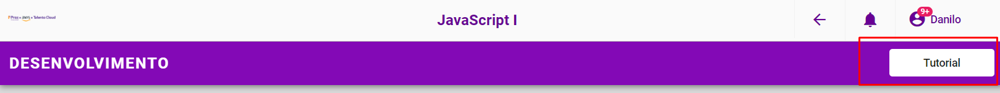

# Botão do tutorial

Neste caso a interatividade ocorreria onde o botão que possui um EventListener associado que ao clicar chama uma função que permite executar um código javascript que invoca um modal com um vídeo embutido com a explicação da tarefa.
