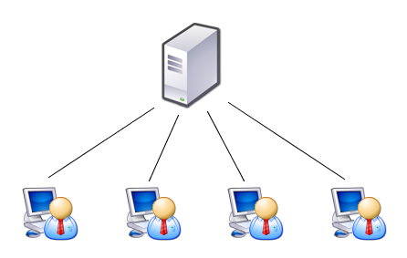

# Arquitetura Cliente-Servidor

A arquitetura cliente-servidor é um modelo de computação distribuída onde as responsabilidades são divididas entre clientes, que solicitam serviços ou recursos, e servidores, que fornecem esses serviços ou recursos. Funciona da seguinte forma: o cliente envia uma solicitação ao servidor, que processa essa solicitação e envia uma resposta de volta ao cliente. A comunicação entre eles geralmente ocorre por meio de redes de computadores, como a Internet. Essa arquitetura é amplamente utilizada em sistemas distribuídos, como aplicativos da web, serviços de e-mail e bancos de dados, devido à sua capacidade de distribuir tarefas e recursos de forma eficiente entre diferentes componentes do sistema.